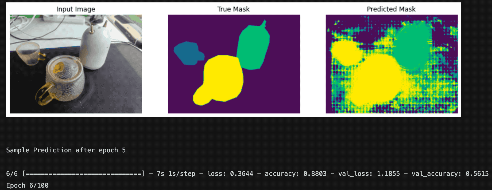

# tensorflow-unet-labelme

[The easiest way to train a U-NET Image Segmentation model using TensorFlow and labelme
](https://makeoptim.com/en/deep-learning/yiai-unet)

Build [U-Net](https://arxiv.org/abs/1505.04597) with [TensorFlow 2](https://www.tensorflow.org/) and train a dataset annotated with [labelme](https://github.com/wkentaro/labelme).



## Installation

If you are using **macOS**, you need to execute the following command before installation.

```sh
❯ brew install pyqt
```

Execute the following command to install the unet environment.

```sh
❯ conda create -n unet -y python=3.9 && conda activate unet && pip install -r requirements.txt
```

## Datasets

### Annotate images

Annotate images with [labelme](https://github.com/wkentaro/labelme).

### Generate VOC format dataset

Save the labeled training data to `datasets/train`, and create a new `datasets/labels.txt`, the content is the classification names, see <https://github.com/wkentaro/labelme/tree/main/examples/semantic_segmentation>

Execute the following command to generate the voc dataset.

```sh
❯ make voc
```

> Note: If you want to regenerate and overwrite the old one, you can execute the following command.
>
> ```sh
> ❯ make re-voc
> ```

## Training

Train and predict with [unet.ipynb](./unet.ipynb)
